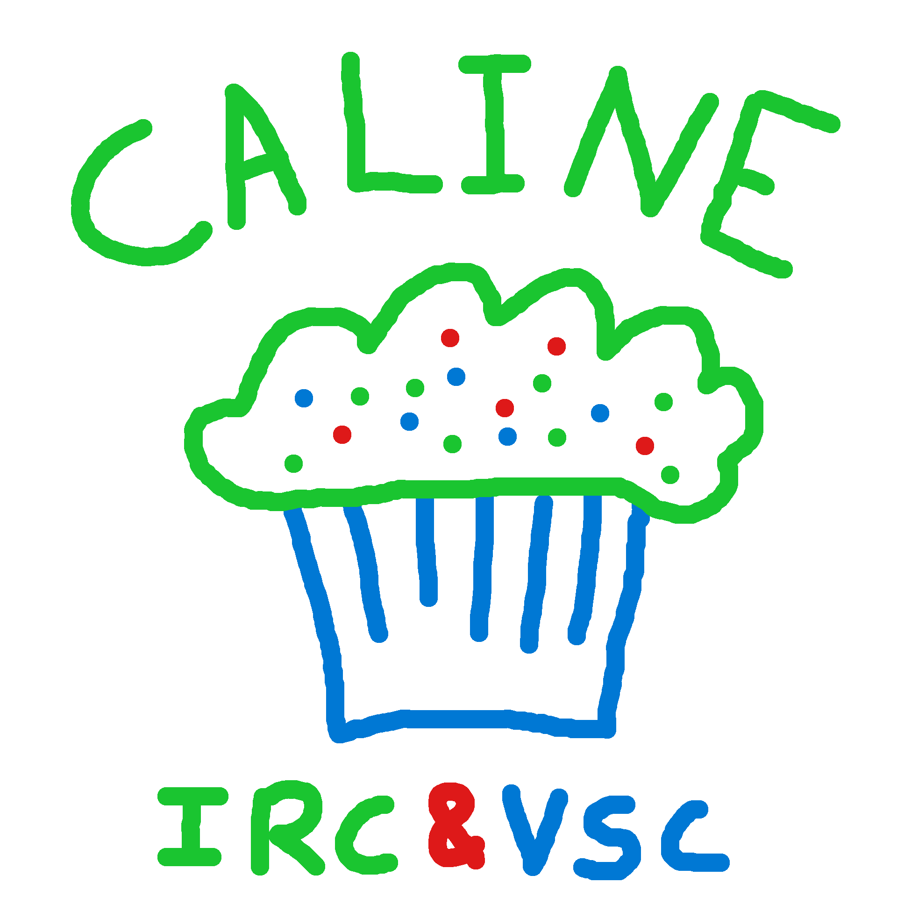

# Caline — IRC Client for VS Code

A native IRC client integrated directly into your editor.



> **Early release** — if you encounter a bug or want to suggest an improvement, please [open an issue](https://github.com/Axel-Ollivier/caline/issues).

## Features

- Connect to multiple IRC servers simultaneously
- Sidebar with servers, channels, direct messages, and member lists
- Tabbed chat interface for channels and DMs
- Slash commands (`/join`, `/part`, `/msg`)
- Auto-join channels on connect
- Auto-reconnect with configurable retries
- TLS support
- Nick colours

## Quick Start

1. Open the **Caline IRC** panel in the activity bar
2. Click the plug icon (or run `Caline: Connect to IRC Server` from the command palette)
3. Enter your server details
4. Use `/join #channel` or click **Join Channel** in the Channels view

## Configuration

```jsonc
// settings.json
{
  "caline.servers": [
    {
      "name": "Libera Chat",
      "host": "irc.libera.chat",
      "port": 6697,
      "nick": "myNick",
      "tls": true,
      "autoJoin": ["#vscode"]
    }
  ]
}
```

### Server Properties

| Property | Type | Required | Default | Description |
|---|---|---|---|---|
| `name` | `string` | yes | | Display name |
| `host` | `string` | yes | | Server hostname |
| `nick` | `string` | yes | | Nickname |
| `port` | `number` | | `6667` | Server port |
| `tls` | `boolean` | | `false` | Enable TLS |
| `password` | `string` | | | Server password |
| `autoJoin` | `string[]` | | `[]` | Channels to join on connect |

## Commands

### Command Palette

| Command | Description |
|---|---|
| `Caline: Connect to IRC Server` | Connect to a configured server |
| `Caline: Disconnect from IRC Server` | Disconnect from a server |
| `Caline: Join Channel` | Join a channel |
| `Caline: Leave Channel` | Leave the current channel |
| `Caline: New Private Message` | Start a DM with a user |
| `Caline: Remove Server` | Remove a server from the list |

### Slash Commands

| Command | Example | Description |
|---|---|---|
| `/join` | `/join #general` | Join a channel |
| `/part` | `/part #general` | Leave a channel |
| `/msg` | `/msg alice hey` | Send a direct message |

## Requirements

VS Code 1.85 or later.
